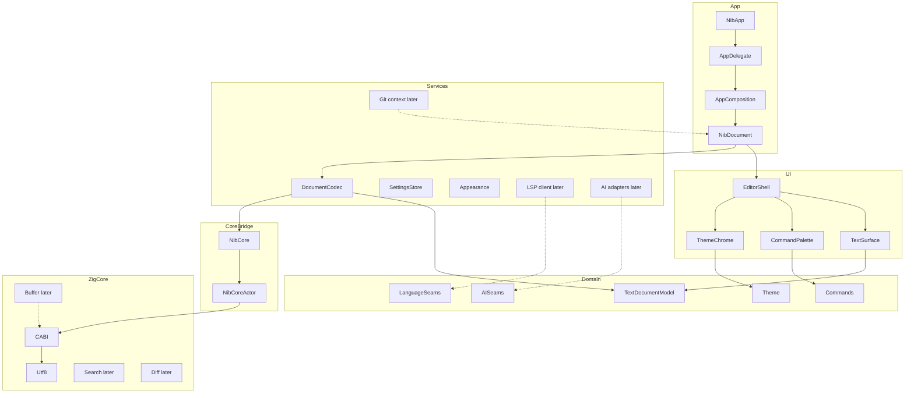
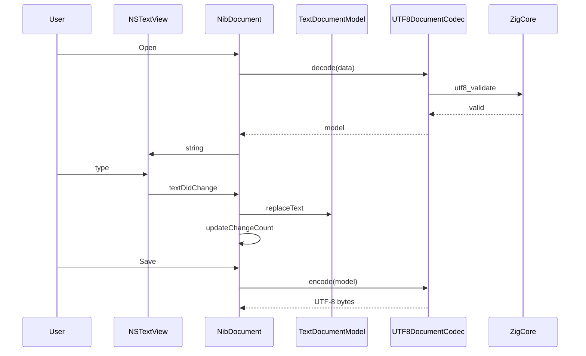

# Architecture

nib is a native macOS document-based editor. The process owns one composition root. Each open file is an `NSDocument` with a single editor pane. Performance-sensitive primitives live in Zig behind a C ABI. Language intelligence, AI, and Git are services behind protocols so the first slice can ship without them.

## System diagram

## Module responsibilities

### App

- Process lifecycle (`NibApp`, `AppDelegate`)
- Composition root (`AppComposition`): constructs services and injects them into windows
- `NibDocument`: file lifecycle, dirty state, save panel integration
- Menu and command registration that target the first responder or the current document

### UI

- Thin SwiftUI shells and overlays
- `NSViewRepresentable` TextKit 2 surface
- Command palette presentation and keyboard handling
- Theme application to chrome and the text view
- Accessibility adapters later (labels, rotors, custom AX for overlays)

UI depends on Domain and Services. It does not import Zig or the C ABI header.

### Domain

Pure models and protocols. No AppKit except where a type is an unavoidable system alias (none in this slice).

- `TextDocumentModel`, encodings, line endings, document errors, recovery payload
- Theme tokens and theme documents
- Editor commands and `CommandRegistry`
- Go-to-line parser
- Language descriptors and detection protocol
- Diagnostics, completions, and LSP document identity (seams)
- AI request/response, tool calls, and permission flags (seams)

### Services

- UTF-8 document codec (uses CoreBridge for validation; preserves BOM and original mixed-ending bytes until edit)
- Settings persistence (`UserDefaults` for appearance and editor settings)
- Recovery snapshots in Application Support (not in-place autosave)
- Appearance preference application
- Logging via `os.Logger` only
- Protocol stubs for LSP, AI providers, secret storage, and Git

### CoreBridge

- C header contract plus Swift `@_silgen_name` wrappers (no pkg-config required)
- Swift surface (`NibCore`) with typed errors
- `NibCoreActor` so Zig calls are serialized until the core documents thread safety

### ZigCore

Today: version string and UTF-8 validation.

Planned: rope or piece table, search, diff, optional parse/index helpers.

Not planned for Zig: UI, LSP JSON-RPC, HTTP, Keychain, `NSFileCoordinator`.

### Tests

- `Tests/DomainTests` — document model, encodings, commands, settings, recovery
- `Tests/CoreBridgeTests` — FFI contract
- `ZigCore` tests — Zig-side behavior without Swift
- App UI tests — later (Phase 6)

## Dependency rules

1. **Downward only:** App → UI → Services → Domain.
2. **CoreBridge may import Domain** for shared error types; Domain must not import CoreBridge.
3. **Services may import CoreBridge** for validation and later search/diff.
4. **UI never imports CoreBridge or Zig.** Persistence and the document codec sit in Services.
5. **Zig never calls Swift.** The C ABI is inbound-only.
6. **No new process-wide singletons** outside the composition root and `NSDocumentController`.
7. **No vendor SDK** in Domain. AI providers are adapters in Services.

## Swift ↔ Zig FFI contract

The public C header is [`ZigCore/include/nib_core.h`](ZigCore/include/nib_core.h). Principles:

| Topic | Rule |
| --- | --- |
| ABI | C only. No Zig types in Swift. No Swift types in Zig. |
| Encoding | All text is UTF-8. Invalid UTF-8 is an error, never silently repaired at this layer. |
| Integers | Fixed-width (`int32_t`, `size_t`). `0` is false / failure where documented; see header comments. |
| Input buffers | Caller owns. Zig must not free or retain them after return. |
| Output strings | Immutable process-lifetime constants may be returned as `const char *` (version). Allocated output, when added, must have a matching `nib_core_*_free`. |
| Errors | Integer codes at the ABI; Swift enums in CoreBridge. Never throw across the boundary. |
| Threading | Zig core is **not** thread-safe in this slice. Swift calls it on `NibCoreActor` or the main actor via the codec. |
| Testing | Header + Zig tests + Swift wrapper tests. A change to the header is a contract change. |

Initial functions:

- `nib_core_version(void)` → NUL-terminated UTF-8 version
- `nib_core_utf8_validate(const uint8_t *, size_t)` → `1` valid, `0` invalid

## Concurrency model

- **MainActor:** `NSDocument`, `NSTextView`, SwiftUI views, menu actions, appearance changes.
- **Document mutations:** Main-thread in this slice because TextKit owns the live buffer. The Domain model is a value snapshot synced from the text view.
- **Background:** file reads of large documents (Phase 1), Tree-sitter edits (Phase 2), LSP I/O (Phase 3), AI streams (Phase 4). Always `Task` + cancellation tokens.
- **Cancellation:** first-class for autocomplete, LSP, parse, index, agent runs, and large file I/O. This slice has no long-running work yet; seams should accept `Task` cancellation from the start.
- **Isolation:** Services that talk to processes (LSP, Git, shell) will be actors. UI observes published snapshots, not live process state.

## Data flows

### Editing (this slice)

TextKit remains the live editing buffer so IME, undo, and accessibility stay native. `TextDocumentModel` is the durable snapshot used for save, dirty, line-ending restoration, and later LSP/AI context.

### LSP completions (Phase 3 — real stdio + demo)

1. Document opens → controller auto-detects a server on PATH for the language (or uses FakeLSP).
2. Client sends `textDocument/didOpen` (full text), then debounced full-document `didChange`.
3. Completion request (`⌃Space`) carries URI, position, and cancels the prior feature task.
4. Results map to Domain `CompletionItem` and render in `CompletionOverlayView`.
5. Hover (`⌥⌘.`) and `publishDiagnostics` feed the bottom status bar.
6. Missing server / LSP off → status message only; editing continues.

### AI edits (Phase 4–5 — designed, not implemented)

1. User invokes an action (“edit selection”, agent task).
2. UI builds an `AIRequest` with an explicit `ContextDisclosure` (what will be sent).
3. Permission gate checks `ToolPermission` against the current grant.
4. Provider adapter streams tokens; orchestrator records tool calls.
5. Proposed writes become a Domain diff. The user accepts or rejects.
6. Accepted edits apply through the document (undo stack), never by silently replacing the file on disk.

## Error handling and logging

- Domain and Services use typed `Error` enums (`DocumentError`, future `LSPError`, `AIProviderError`).
- User-visible failures go through `NSDocument` / `NSAlert` or a future in-app banner. No silent data loss: refuse unsupported encodings; do not rewrite bytes we cannot round-trip.
- Internal failures use `os.Logger` (`com.chaseelder.nib`). Categories: `app`, `document`, `core`, `lsp`, `ai`.
- **No crash analytics, no telemetry pipeline, no network logger.**
- FFI failures become Swift errors at CoreBridge. Zig does not log.

## Plugin and extensibility posture

v1 is not a plugin host. Extension points are in-process protocols:

- `LanguageDetecting`, `SyntaxHighlighting` (Phase 2 — Tree-sitter JSON/Markdown/Python + regex fallbacks)
- `LanguageServerClienting`, `LanguageServerInstalling` (Phase 3)
- `AIProvider`, `AgentTool`, `SecretStoring` (Phase 4–5)
- `TextSurface` — so the renderer can be replaced without rewriting Domain

A future plugin model (Phase 6+) should load language definitions, themes, and provider adapters from versioned files — not arbitrary native code — until a security story exists. Themes are already file-based JSON so a theme editor/importer does not require a redesign.
